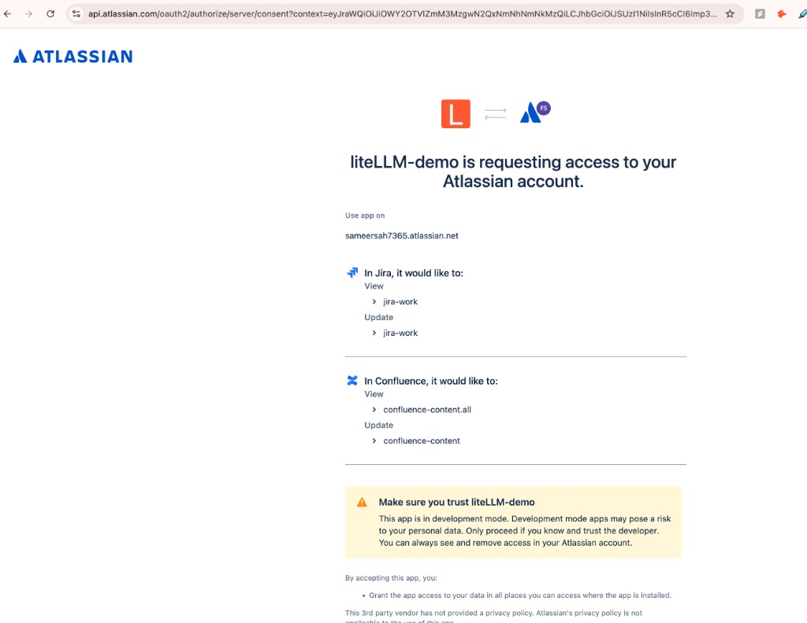
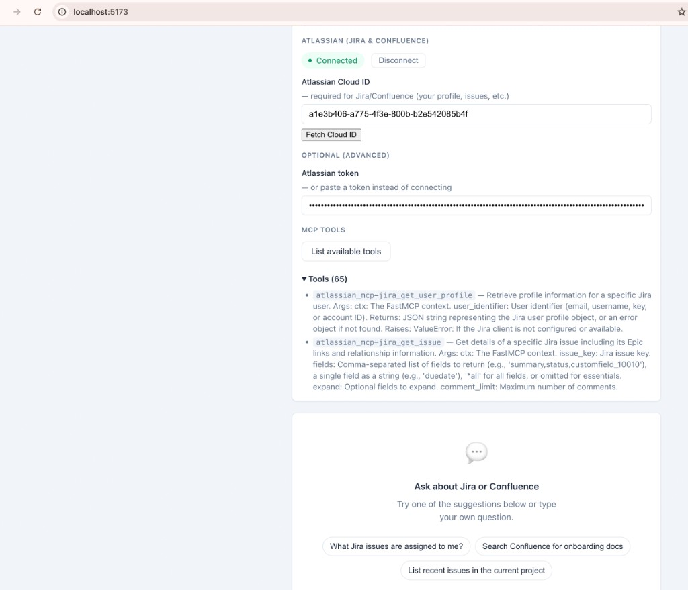

# LiteLLM + Atlassian MCP Demo

A **user-facing demo** that uses **LiteLLM's config.yaml** as an MCP gateway and the **Atlassian MCP server** (Jira + Confluence) so an LLM can call Jira/Confluence tools on behalf of the user.

## How it works

```
┌─────────────────┐     ┌──────────────────┐     ┌─────────────────────┐
│  Demo Web App    │────▶│  LiteLLM Proxy   │────▶│  Atlassian MCP      │
│  (React)         │     │  (config.yaml)   │     │  (Jira + Confluence)│
│                  │     │                  │     │  streamable-http   │
│  - Chat UI       │     │  - MCP gateway   │     │  :9000/mcp          │
│  - User sends    │     │  - Forwards      │     │  - jira_search,     │
│    Atlassian     │     │    auth headers  │     │    confluence_*,    │
│    token         │     │  - /v1/chat/     │     │    etc.             │
└─────────────────┘     │    completions    │     └─────────────────────┘
                        │  - /atlassian_mcp│
                        │    /mcp (JSON-RPC)│
                        └──────────────────┘
```

1. **LiteLLM Proxy** loads `config.yaml`, which defines:
   - A model (e.g. `gpt-4o-mini`) for chat.
   - An MCP server `atlassian_mcp` pointing at the Atlassian MCP HTTP endpoint (`http://localhost:9000/mcp`).
   - **Option 1 (Interactive OAuth / PKCE):** `auth_type: oauth2` with Atlassian `authorization_url` and `token_url`; LiteLLM mediates discovery, authorize redirect, and token exchange. The app sends the user’s token in the **Authorization** header and LiteLLM API key in `x-litellm-api-key`.
   - `extra_headers` so the proxy forwards the user’s **Authorization** and **X-Atlassian-Cloud-Id** to the MCP server (per-request auth).

2. **Atlassian MCP** runs as a separate process (streamable-http on port 9000). For **Option 1** run with **`ATLASSIAN_OAUTH_ENABLE=true`** so it accepts per-request `Authorization: Bearer <user_token>` and optional `X-Atlassian-Cloud-Id`. See [mcp-atlassian HTTP transport](https://personal-1d37018d.mintlify.app/docs/http-transport) and [authentication](https://personal-1d37018d.mintlify.app/docs/authentication).

3. **Demo app** (React):
   - User enters LiteLLM URL and LiteLLM API key.
   - **Connect to Atlassian** (Option 1): OAuth 2.0 PKCE flow via LiteLLM — user is redirected to Atlassian to sign in, then back to the app; the app exchanges the code for tokens via LiteLLM and stores the access token. No manual token paste.
   - Alternatively, user can paste an **Atlassian token** and optional **Cloud ID** in Settings.
   - **List MCP tools**: `POST /atlassian_mcp/mcp` with JSON-RPC `tools/list`.
   - **Chat**: `POST /v1/chat/completions` with MCP tools; the app sends **Authorization: Bearer &lt;access_token&gt;** (and `x-litellm-api-key`) so LiteLLM forwards the token to the Atlassian MCP server.

References:
- [LiteLLM MCP OAuth](https://docs.litellm.ai/docs/mcp_oauth) (PKCE for user-facing, M2M for backend).
- [LiteLLM MCP overview](https://docs.litellm.ai/docs/mcp) and [usage](https://docs.litellm.ai/docs/mcp_usage).
- [mcp-atlassian](https://github.com/sooperset/mcp-atlassian) and [HTTP transport](https://personal-1d37018d.mintlify.app/docs/http-transport).

## Screenshots

**Atlassian OAuth consent** — When you click “Connect to Atlassian”, you’re redirected to Atlassian to authorize the app (e.g. liteLLM-demo) to access Jira and Confluence on your behalf.



**Demo app** — After connecting, set your Atlassian Cloud ID (or use “Fetch Cloud ID”), then list MCP tools and chat with the assistant using Jira/Confluence.



## Prerequisites

- **Python 3.10+** (for LiteLLM and mcp-atlassian).
- **Node 18+** (for the demo app).
- **OpenAI API key** (for the model in LiteLLM).
- **Atlassian**: either an API token (Cloud) or OAuth/BYOT for the MCP server (see mcp-atlassian docs).

## Setup

### 1. Atlassian MCP server (streamable-http)

Run the Atlassian MCP server so it exposes an HTTP MCP endpoint.

**Option A – API token (single user / dev):**

```bash
# Create API token at https://id.atlassian.com/manage-profile/security/api-tokens
export JIRA_URL=https://your-company.atlassian.net
export JIRA_USERNAME=your.email@company.com
export JIRA_API_TOKEN=your_api_token
export CONFLUENCE_URL=https://your-company.atlassian.net/wiki
export CONFLUENCE_USERNAME=your.email@company.com
export CONFLUENCE_API_TOKEN=your_api_token

uvx mcp-atlassian --transport streamable-http --port 9000 -vv
```

**Option B – Multi-user OAuth (user-facing):**

See [mcp-atlassian OAuth](https://personal-1d37018d.mintlify.app/docs/authentication#oauth-20-cloud---advanced) and [multi-user](https://personal-1d37018d.mintlify.app/docs/http-transport#multi-user-authentication). Run OAuth setup once, then start the server with `ATLASSIAN_OAUTH_ENABLE=true` so each request can send its own `Authorization: Bearer <user_token>` and optional `X-Atlassian-Cloud-Id`.

Ensure the MCP is reachable at **http://localhost:9000/mcp** (or update `config.yaml` with the URL you use).

### 2. LiteLLM Proxy (Option 1 – OAuth PKCE)

Set environment variables (use `.env` from `.env.example`; never commit secrets):

```bash
# From repo root
export OPENAI_API_KEY=sk-...
export ATLASSIAN_OAUTH_CLIENT_ID=your_atlassian_oauth_client_id
export ATLASSIAN_OAUTH_CLIENT_SECRET=your_atlassian_oauth_client_secret

litellm --config config.yaml --port 4000
```

- **Atlassian OAuth app:** In [Atlassian Developer Console](https://developer.atlassian.com/console/myapps/) create an OAuth 2.0 (3LO) app. For **Option 1**, set the **Callback URL** to **`http://localhost:4000/callback`** (LiteLLM’s callback; the proxy receives the code from Atlassian and then redirects the user to the demo app).
- Proxy will be at **http://localhost:4000**. Create an API key in the LiteLLM UI or set `LITELLM_MASTER_KEY` and use that in the demo app.

### 3. Demo app

```bash
cd demo-app
cp .env.example .env
# Edit .env and set VITE_ATLASSIAN_OAUTH_CLIENT_ID (same as Atlassian OAuth app client ID)
npm install
npm run dev
```

Open **http://localhost:5173**.

- **Settings**: set LiteLLM URL (e.g. `http://localhost:4000`) and LiteLLM API key.
- **Connect to Atlassian**: starts the PKCE flow (redirect to LiteLLM → Atlassian → back to app); the app then has an access token for MCP/chat. You can also paste an Atlassian token manually and optionally set Cloud ID.
- **List MCP tools**: verifies proxy + MCP and shows tools.
- **Chat**: ask natural language questions; the model uses Atlassian MCP tools when you’re connected or have provided a token.

## Config overview

**`config.yaml`** (Option 1 – OAuth PKCE excerpt):

```yaml
model_list:
  - model_name: gpt-4o-mini
    litellm_params:
      model: openai/gpt-4o-mini
      api_key: os.environ/OPENAI_API_KEY

mcp_servers:
  atlassian_mcp:
    url: "http://localhost:9000/mcp"
    auth_type: oauth2
    client_id: os.environ/ATLASSIAN_OAUTH_CLIENT_ID
    client_secret: os.environ/ATLASSIAN_OAUTH_CLIENT_SECRET
    authorization_url: "https://auth.atlassian.com/authorize"
    token_url: "https://auth.atlassian.com/oauth/token"
    scopes: ["read:jira-work", "write:jira-work", "read:confluence-content.all", "write:confluence-content", "offline_access"]
    extra_headers:
      - "Authorization"
      - "X-Atlassian-Cloud-Id"
```

- **Option 1 flow:** Discovery → user clicks “Connect to Atlassian” → redirect to LiteLLM `/atlassian_mcp/authorize` → LiteLLM redirects to Atlassian → user approves → Atlassian redirects to LiteLLM `/callback` → LiteLLM redirects to app `/oauth/callback` with code → app calls LiteLLM `/atlassian_mcp/token` to exchange code for tokens → app stores token and sends **Authorization: Bearer &lt;token&gt;** (and `x-litellm-api-key`) on MCP and chat requests. LiteLLM forwards the token to the Atlassian MCP server.

## CORS

If the demo app runs on a different origin (e.g. `http://localhost:5173`) and LiteLLM is on `http://localhost:4000`, enable CORS on LiteLLM or run the app behind a reverse proxy that serves both. LiteLLM supports CORS configuration in its deployment settings.

## Summary

| Component        | Role |
|-----------------|------|
| **config.yaml** | LiteLLM model + MCP server `atlassian_mcp` with OAuth2 (Option 1), Atlassian URLs, env-based client_id/secret, and header forwarding. |
| **Atlassian MCP** | Jira/Confluence tools over HTTP; run with `ATLASSIAN_OAUTH_ENABLE=true` for per-request token auth. |
| **Demo app**    | User-facing UI: “Connect to Atlassian” (PKCE via LiteLLM), list tools, chat via `/v1/chat/completions` with MCP tools and user Atlassian token. |

This gives you a working user-facing demo that uses LiteLLM’s config and the Atlassian MCP server end-to-end with Interactive OAuth (PKCE).
